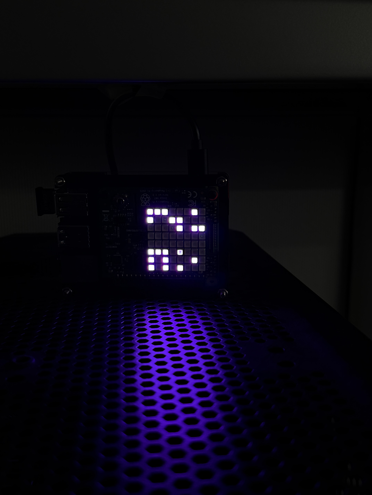
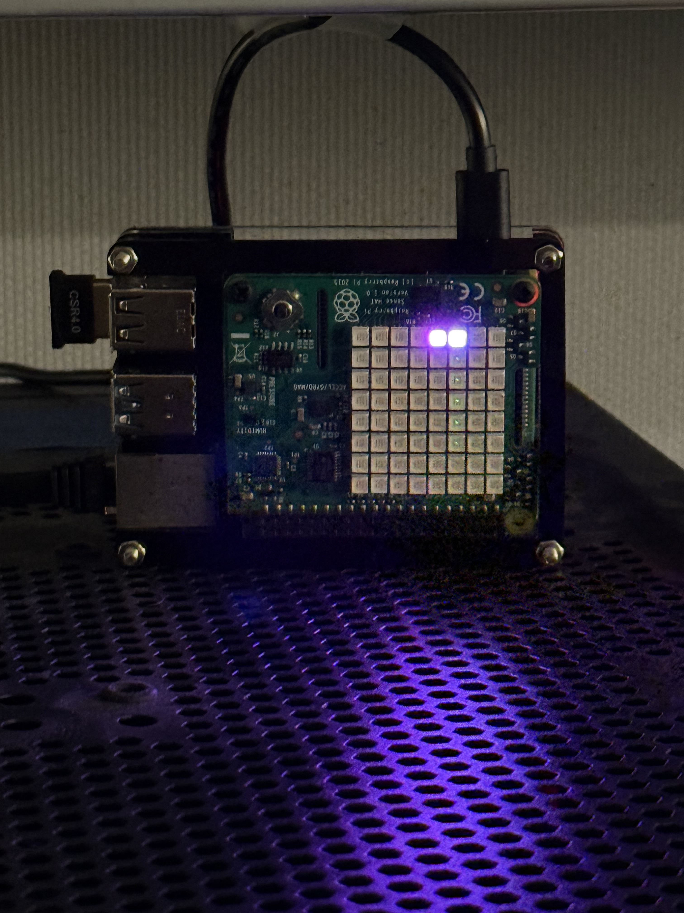

# pi-hat-ca

Conway's Game of Life on a Raspberry Pi Sense HAT LED matrix with toroidal grid, auto-reseeding, joystick controls, installable as a systemd service.



The 8x8 LED matrix is treated as a torus: patterns that run off one edge wrap around to the opposite side. The simulation runs forever — when the board dies out or settles into a repeating cycle, it automatically reseeds itself with a fresh random soup. Newborn cells briefly render in a lighter shade of the configured color so you can watch the dynamics.

New to cellular automata? [John Conway explains the Game of Life](https://youtu.be/CgOcEZinQ2I) in a segment from *Stephen Hawking's The Meaning of Life* — the rules, and why such simple ones produce gliders, oscillators, and self-replicating structure.

## Hardware

- [Raspberry Pi 4 Model B (2 GB)](https://a.co/d/0ebAV7Bx)
- [Raspberry Pi Sense HAT (v1)](https://a.co/d/0aupKPAa)

## Install

Clone onto a Raspberry Pi with a Sense HAT attached, then:

```bash
./install.sh
```

This installs and starts `pi-hat-ca.service`, a systemd service that launches the simulation on every boot and restarts it if it ever crashes. Remove everything with:

```bash
./install.sh uninstall
```

## Configuration

Runtime options live in `/etc/default/pi-hat-ca` (seeded by the installer, never overwritten on reinstall):

```
LIFE_OPTS=--color 212,0,208 --speed 1.0 --brightness 0.03
```

| Flag | Meaning |
|------|---------|
| `--color R,G,B` | Cell color, three 0–255 values |
| `--speed N` | Generations per second (fractional values allowed, e.g. `0.5` = one step every 2 s) |
| `--brightness B` | LED brightness from 0.0 (off) to 1.0 (full), scales the LED gamma table |

After editing, apply with:

```bash
sudo systemctl restart pi-hat-ca
```

You can also run it directly (stop the service first so they don't fight over the display):

```bash
./life.py --color 0,120,255 --speed 4 --brightness 0.2
```

## Joystick controls

The Sense HAT's 5-way joystick (circled below) adjusts the simulation live:



| Input | Action |
|-------|--------|
| Up | Brightness up |
| Down | Brightness down |
| Right | Speed up |
| Left | Slow down |
| Center press | Reseed with a fresh random soup |

Each press scales brightness by 1.3x and speed by 1.5x; holding a direction repeats. Joystick changes are runtime-only — restarting the service returns to the values in `/etc/default/pi-hat-ca`.

Note: this Pi is mounted upside-down, so `life.py` inverts the raw joystick directions to match the physical orientation shown above. If your HAT is right-side-up, swap the direction handling in `Controls.handle_events`.
